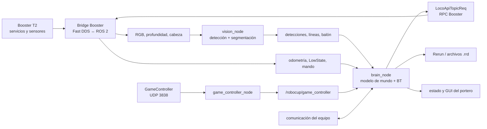

# Arquitectura del demo, brain y comportamientos

## Flujo general



El demo no es un único ejecutable. Es una cadena en la que una salida válida de
un componente puede ser inútil si falta su marco, timestamp o consumidor.

## Paquetes

| Paquete | Responsabilidad |
|---|---|
| `booster_msgs` | Mensajes genéricos de petición/respuesta RPC y datos binarios. |
| `booster_interface` | Mensajes ROS del robot: IMU, odometría, estado/comando articular, mando y servicio RPC. |
| `game_controller_interface` | Estructuras ROS del protocolo RoboCup. |
| `vision_interface` | Detecciones, líneas, balón y calibración de visión. |
| `vision` | Captura/sincronía, TensorRT, detector, segmentación y publicación. |
| `game_controller` | Receptor/validador UDP y publicación del estado de partido. |
| `brain` | Fusión, localización, estrategia, árbol de comportamiento y comandos. |

## Entradas principales de brain

```text
/booster_vision/detection
/booster_vision/line_segments    # condicionado a segmentación
/odometer_state
/low_state
/head_pose
/boostercamera/head/head_pose_stamped
fall_down_recovery_state
/boostercamera/head/rgb
/boostercamera/head/depth
/boostercamera/head/rgb/camera_info
/robocup/game_controller
/remote_controller_state
LocoApiTopicResp
```

La imagen RGB se suscribe desde brain solo cuando el logging de imagen lo
requiere. La estrategia debe depender de las detecciones publicadas, no de que
Rerun tenga un panel abierto.

Salidas importantes:

```text
LocoApiTopicReq
/kick_ball
/play_sound
/speak
/brain/goalkeeper/decision       # extensión de esta rama
/brain/goalkeeper/status         # extensión de esta rama
```

El demo original no publica un topic genérico con el nodo activo del árbol. La
decisión del portero sí se agregó en esta rama; para el resto se usan logs,
blackboard y entidades de Rerun.

## Ciclo interno del brain

1. carga YAML, calibración de visión y XML del árbol;
2. inicializa el blackboard con rol, estados GC, flags del balón, localización y
   control;
3. crea comunicaciones ROS/Booster y logging;
4. callbacks actualizan odometría, detecciones, marcas, cabeza, caídas, mando y
   estado del partido;
5. actualiza modelo de mundo: pose propia, balón, compañeros y obstáculos;
6. ejecuta un tick del Behavior Tree;
7. el nodo activo manda cabeza, velocidad, patada o acción;
8. registra diagnóstico y actualiza GUI/Rerun.

El blackboard desacopla el “qué sé” del “qué hago”. Variables relevantes:

```text
player_role
ball_location_known
tm_ball_pos_reliable
odom_calibrated
decision
gc_game_state
gc_game_sub_state_type
gc_is_under_penalty
wait_for_opponent_kickoff
goalie_mode
goalie_kick_type
control_state
go_manual / assist_chase / assist_kick
```

## Árbol principal `game.xml`

Es el árbol apropiado para partido. La prioridad es aproximadamente:

```text
inicializar ACTION
  → intervención manual/cancelación
  → recalibración
  → recuperación de caída
  → penalización
  → timeout
  → estado normal INITIAL/READY/SET/PLAY/END
  → tiro libre STOP/EXECUTE
```

Una `ReactiveSequence` reevalúa condiciones en cada tick. Si aparece una
condición prioritaria, el comportamiento inferior deja de ser dueño del
movimiento. Por eso un robot puede detener una persecución sin que el nodo de
`Chase` haya fallado.

Otros árboles:

- `demo.xml`: demostraciones y toma manual, menos estricto para competencia;
- `chase.xml`: prueba enfocada en búsqueda/persecución;
- árbol de calibración: usado por scripts específicos, no por juego normal.

El argumento de launch selecciona solo el nombre dentro de
`brain/behavior_trees`:

```bash
ros2 launch brain launch.py tree:=game.xml
ros2 launch brain launch.py tree:=chase.xml
```

## Subárbol de localización

`Locate` combina observaciones en este orden:

```text
SelfLocate(trust_direction)
SelfLocate1M
SelfLocate2T
SelfLocatePT
SelfLocateLT
SelfLocate2X
SelfLocateBorder
```

Los nombres representan combinaciones de marcas de campo: líneas y cruces
tipo L, T, X, punto/marca y borde. El intervalo configurado en XML es 300 ms y
el límite típico de distancia/deriva es 5.0/3.5. Una sola marca ambigua no debe
reemplazar sin filtro toda la pose.

## Percepción y búsqueda del balón

`CamFindAndTrackBall`:

- si la posición local o la de un compañero es confiable, `CamTrackBall`;
- si no, `CamFindBall` mueve la cabeza para buscar.

`FindBall` añade `RobotFindBall`, que puede girar el cuerpo mientras la cámara
busca. Esto explica movimiento aunque aún no se haya visto el balón. En pruebas
de banco use un árbol que no contenga búsqueda corporal o limite el espacio.

## Del estado a la acción del delantero

El flujo simplificado es:

```text
localizar → atender kickoff/balón fuera → mirar/buscar balón
→ CalcKickDir → StrikerDecide
→ find | assist | chase | auto_visual_kick | adjust | kick | cross
```

- `CalcKickDir` decide la dirección táctica de remate;
- `StrikerDecide` decide la fase de aproximación;
- `Chase` reduce distancia;
- `Adjust` corrige pose alrededor del balón;
- `Kick` ejecuta la patada convencional;
- `RLVisionKick` ejecuta la variante guiada por visión.

El XML contiene límites de velocidad y distancias; el C++ calcula condiciones,
objetivos y comandos. Para entender una decisión hay que leer ambos.

## Del estado a la acción del portero

En modo `attack`:

```text
localizar → seguir/buscar balón → GoalieDecide
→ block_shot | find | retreat | chase | adjust | kick
```

En modo `guard`, prioriza la posición de cobertura y el bloqueo; si no conoce
el balón, vuelve a una posición lista. `GoalkeeperBlockShot` consume el punto de
cruce predicho cuando el predictor está habilitado y válido.

La patada se elige en XML sin cambiar el resto del árbol:

```text
decision=kick + goalie_kick_type=default → Kick
decision=kick + goalie_kick_type=visual  → RLVisionKick
```

El demo original del portero solo tenía la ruta convencional operativa; el XML
original está preservado como `subtree_goal_keeper_play_original.xml`.

## Qué ocurre al faltar el segundo robot

La localización propia no necesita dos robots: usa marcas del campo, odometría y
la percepción de esta unidad. Por tanto, puede calibrarse con un solo T2.

Sí cambian funciones colectivas:

- no hay balón compartido confiable;
- no hay selección real de líder/propietario del balón;
- formaciones y asistencia se degradan;
- la sustitución/claim de portero puede depender de estado del equipo;
- dos unidades con el mismo `player_id` se pisan lógicamente.

La posición de `READY` debe ser determinista por rol/jugador, pero hay que
comprobar que la configuración no espere un compañero para una condición
específica del experimento.

## GameController de extremo a extremo

`game_controller_node`:

1. escucha en `0.0.0.0:3838/UDP`;
2. exige longitud exacta de la estructura;
3. valida header y versión del protocolo;
4. valida estado, fase, set play, equipos y kicking team;
5. aplica `ip_white_list` si está activa;
6. publica `/robocup/game_controller`.

Brain busca `game.team_id` en uno de los dos equipos recibidos y usa
`player_id - 1` para su penalización. Equipo ausente, jugador fuera de rango o
mensaje inválido evita una transición normal.

## Envío de acciones y confirmación

`RobotClient` construye un `RpcReqMsg` con `api_id` en JSON y lo publica en
`LocoApiTopicReq`. La publicación devuelve éxito local, pero la acción es
asíncrona. La respuesta llega por `LocoApiTopicResp`; la rama actual la usa, por
ejemplo, para consultar modo durante recuperación.

Para acciones críticas implemente siempre:

- correlación entre petición y respuesta;
- timeout;
- verificación de modo/estado final;
- cancelación segura;
- prohibición de comandos incompatibles simultáneos.
