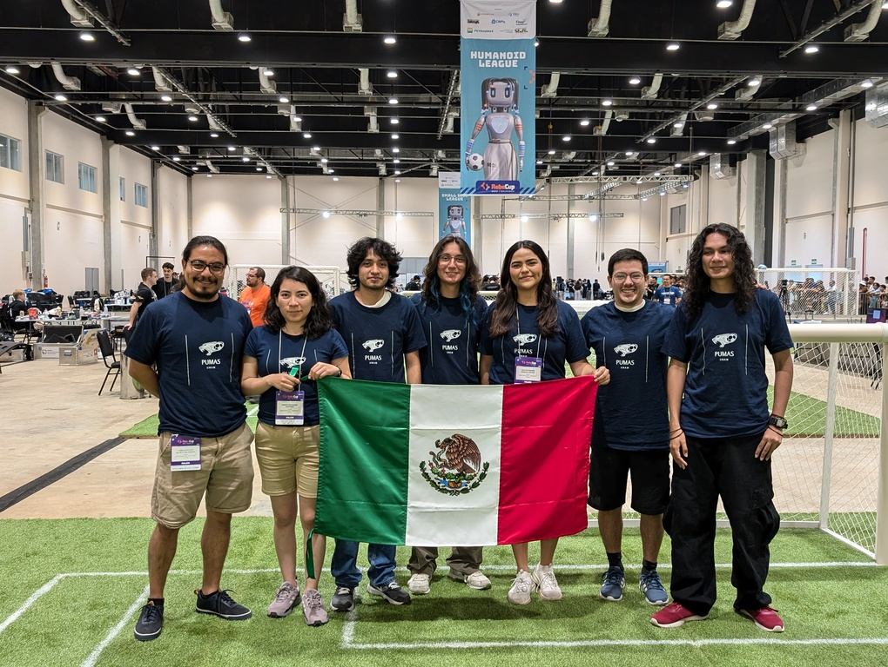

<h1 align="center">
    
</h1>

<p align="center">
    <b>
        Official repository of the Pumas team for the RoboCup Soccer Humanoid League.
    </b>
</p>

<div align="center">
    <h4>
        <a href="./Documentation/Guides/Installation.md">
            Installation
        </a>
        <span> | </span>
        <a href="./Documentation/Guides/Usage.md">
            Usage
        </a>
        <span> | </span>
        <a href="https://lira.unam.mx/">
            Website
        </a>
    </h4>
</div>
    
<p align="center">
    
</p>

<p align="center">
    
    
    
</p>

<p align="center">
    <a href="https://lira.unam.mx/">
        
    </a>
</p>

## Getting Started

### Prerequisites

- [Ubuntu 22.04](https://releases.ubuntu.com/jammy/) or later.
- [ROS2 humble](https://docs.ros.org/en/humble/Installation.html) (`ros-humble-desktop` and `ros-dev-tools` required).
- [jetson-utils](https://github.com/dusty-nv/jetson-utils) (only Booster K1).
- A lot of patience.

> ℹ️ **to-do**: add the remaining dependencies

### Installation

First, clone this repository:

```bash
git clone --recurse-submodules https://github.com/LIRA-UNAM/Pumanoids.git
cd Pumanoids
```
> [!NOTE]
> If you didn't clone the repository with the `--recurse-submodules` flag, you can initialize the submodules with the following commands:
> ```bash
> git submodule init
> git submodule update
> ```

Then, follow the instructions in the [Installation Guide](./Documentation/Guides/Installation.md) to set up the **development environment** and install the necessary **dependencies**.

## Usage

After initializing the environment, run the following command to launch the main nodes:

### For booster T1:

```bash
ros2 launch surge_et_ambula T1_state_machine.launch.py
```

### For booster K1:

```bash
ros2 launch surge_et_ambula K1_state_machine.launch.py
```

### For Unitree G1:

```bash
ros2 launch surge_et_ambula G1_state_machine.launch.py
```

---

> [!NOTE]
> For further instructions on how to run the code and use the different nodes, please refer to the [Usage Guide](./Documentation/Guides/Usage.md).

## License

Distributed under the **MIT License**. This allows for modification, distribution, and commercial use, provided the original copyright and license notice are included.

See [LICENSE](./LICENSE) for details.

&copy; 2025 - 2026 **Laboratorio de Investigación en Robotica Avanzada**
