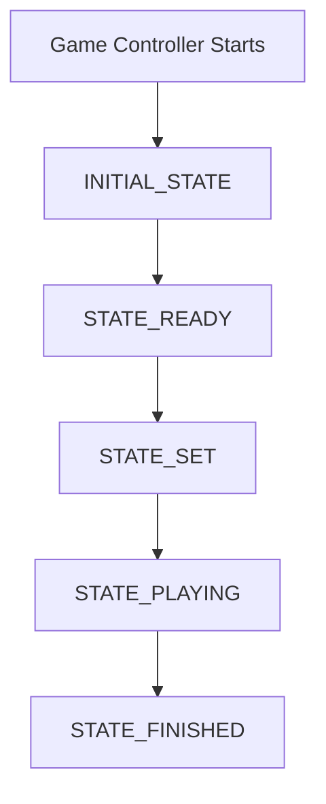

# game_planner package

This package contains the main state machine of the project, which is responsible for the general behavior of the robot during the game.

## Nodes

- `game_planner`: The main state machine node.
- `gamestate`: IDK. Whomever wrote this node, please write a description for it.

> Comming soon:
> - `connection_to_game_controller`: To communicate with Game Controller

## Workflow

> ℹ️ **to-do**: Finish the documentation.