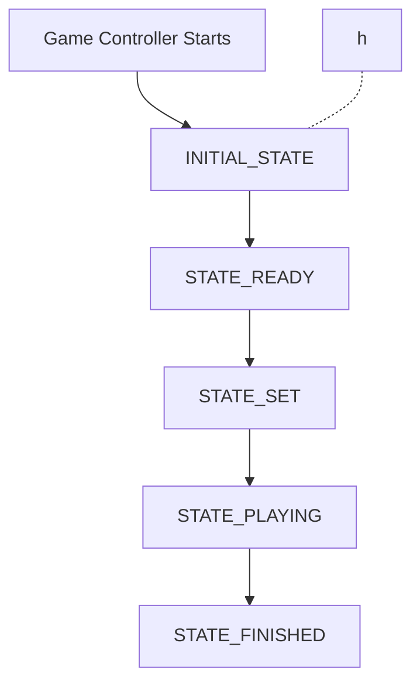

# game_planner node

This is the node responsable for the main state machine for the general behavior of the robot.

Aditionally, it also manages the connection and communication with the Game Controller. This will be moved to a separate node in the future.

| Package | Node | Source file |
| ------- | ---- | ----------- |
| `game_planner` | `game_planner` | [`game_planner.py`](../game_planner/game_planner.py)

## Usage

This node is meant to be executed by the [master launch file](/colcon_ws/src/surge_et_ambula/documentation/X1_state_machine.md) at startup.

To run the `game_planner` node manually:

```bash
ros2 run game_planner game_planner
```

### Node dependencies

> [!NOTE]
> All this nodes are already included in the [master launch file](/colcon_ws/src/surge_et_ambula/documentation/X1_state_machine.md).

While no other nodes are strictly required for `game_planner` to run, it is designed to work in conjunction with the following nodes:

| Package | Node |
| ------- | ---- |
| `twist_to_x1` | [`twist_to_x1`](/colcon_ws/src/hardware/Documentation/twist_to_x1.md) |
| `twist_to_x1` | [`pantilt_to_x1`](/colcon_ws/src/hardware/Documentation/pantilt_to_x1.md) |
| `twist_to_x1` | [`odom_to_tf`](/colcon_ws/src/hardware/Documentation/odom_to_tf.md) |
| `ball_detector` | [`ball_detector`](/colcon_ws/src/vision/ball_detector/ball_detector/ball_detector.py) |
| `ball_follower` | [`ball_follower`](/colcon_ws/src/planning/ball_follower/ball_follower/ball_follower.py) |
| `ball_follower` | [`head_ball_follower`](/colcon_ws/src/planning/ball_follower/ball_follower/head_ball_follower.py) |
| `position_start` | [`position_start`](/colcon_ws/src/planning/position_start/src/position_start.cpp) |

> Replace the `x` in the names with the model of the robot being used (i.e., `twist_to_g1` for the ***Unitree G1***). 

#### Booster K1

For the Booster K1, the `nv12_converter_node` is also required for video encoding conversion.

| Package | Node |
| ------- | ---- |
| `boosterk1_image_proc` | [`nv12_converter_node`](/colcon_ws/src/vision/boosterk1_image_proc/README.md) |

### Topics

| Topic | Role | Type | Description | Nodes related |
| ----- | ---- | ---- | ----------- | ------------- |
| `/head_ball_follower/enable` | Publisher | `std_msgs/msg/Bool` | Enables or disables the robot to follow the ball with the head. | [`head_ball_follower`](/colcon_ws/src/planning/ball_follower/documentation/head_ball_follower.md) |
| `/ball_follower/enable` | Publisher | `std_msgs/msg/Bool` | Enables or disables the robot to walk towards the ball. | [`ball_follower`](/colcon_ws/src/planning/ball_follower/documentation/ball_follower.md) |
| `/position_start/enable` | Publisher | `std_msgs/msg/Bool` | Signals the robot to move to the kick-off position. | [`position_start`](/colcon_ws/src/planning/position_start/README.md) |
| 

### Services

| Service | Role | Type | Description | Nodes related |
| ------- | ---- | ---- | ----------- | ------------- |
| `/booster_rpc_service` | Client | `RpcService` | To make robot recover from a fall. | N/A |
| `/get_goal_robot_pose` | Client | `GetGoalRobotPose` | To get the point where the robot should go to align with the ball and goal. | [`goal_robot_pose_service`](/colcon_ws/src/planning/carry_ball_to_goal/carry_ball_to_goal/goal_robot_pose_service.py) |

## How it works

