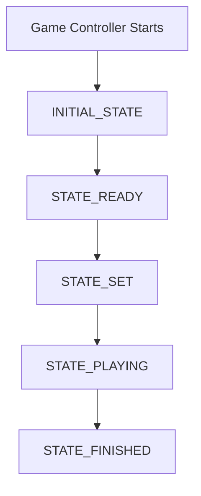

# game_planner package

## Description

This package contains the main state machine of the project, which is responsible for the general behavior of the robot during the game..

## Workflow

> ℹ️ **to-do**: Finish the documentation.